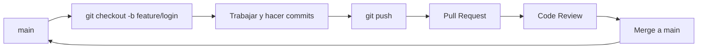

# 📘 Guía de Git para el Equipo

## 🚀 Comandos Clave (Inicio Rápido)

```bash
# Ver en qué rama estás
git branch

# Crear una rama nueva y moverte a ella
git checkout -b nombre-rama

# Cambiar de rama
git switch nombre-rama

# Actualizar tu rama con los últimos cambios
git pull origin nombre-rama

# Guardar cambios
git add .
git commit -m "Descripción del cambio"

# Subir cambios al repositorio
git push origin nombre-rama

# Primera vez que subes una rama
git push -u origin nombre-rama
```

---

## 📋 Índice

1. [Regla de Oro](#regla-de-oro)
2. [Tipos de Ramas](#tipos-de-ramas)
3. [Flujo de Trabajo](#flujo-de-trabajo)
4. [Trabajo en Equipo](#trabajo-en-equipo)
5. [Resolución de Conflictos](#resolución-de-conflictos)
6. [Comandos Detallados](#comandos-detallados)
7. [Preguntas Frecuentes](#preguntas-frecuentes)

---

## ⚠️ Regla de Oro

### ❌ NUNCA hacer commits directamente en `main`

**¿Por qué?**
- La rama `main` debe estar siempre estable y lista para producción
- Si commiteas ahí y algo sale mal, rompes todo el proyecto
- Dificulta el trabajo en equipo y la revisión de código

### ✅ Siempre trabajar en ramas separadas

---

## 🌿 Tipos de Ramas

### Convención de Nombres

| Tipo | Formato | ¿Cuándo usarla? | Urgencia |
|------|---------|-----------------|----------|
| **feature/** | `feature/login` | Nuevas funcionalidades, pantallas, módulos | Normal |
| **fix/** | `fix/error-login` | Corrección de bugs no críticos | Media |
| **hotfix/** | `hotfix/bug-produccion` | Errores críticos en producción | 🚨 Alta |

### Ejemplos Detallados

#### 1. `feature/*` - Nuevas Funcionalidades

**Cuándo usar:**
- Pantallas nuevas
- Nuevos endpoints o APIs
- Nuevas opciones o módulos
- Cualquier cosa que no existía antes

**Ejemplos:**
```bash
feature/login
feature/registro-usuarios
feature/carrito-compras
feature/dashboard-admin
```

**Flujo típico:**
```bash
git checkout main
git checkout -b feature/login
# ... trabajas ...
git commit -m "Agrega formulario de login"
git push origin feature/login
# Luego se hace Pull Request a main
```

---

#### 2. `fix/*` o `bugfix/*` - Corrección de Errores

**Cuándo usar:**
- Bugs detectados en pruebas
- Errores de lógica
- Validaciones mal implementadas
- Problemas visuales (CSS, UI)

**Ejemplos:**
```bash
fix/error-login
bugfix/validacion-email
fix/boton-guardar
```

**Flujo típico:**
```bash
git checkout main
git checkout -b fix/error-login
# ... corriges el bug ...
git commit -m "Corrige validación de contraseña"
git push origin fix/error-login
```

---

#### 3. `hotfix/*` - Errores Urgentes en Producción

**Cuándo usar:**
- La app no levanta
- El login no funciona
- Se caen pagos
- Bugs críticos para el negocio

**Ejemplos:**
```bash
hotfix/error-pagos
hotfix/caida-api
hotfix/bug-produccion
```

**Flujo típico:**
```bash
git checkout main
git checkout -b hotfix/error-pagos
# ... corrección urgente ...
git commit -m "Soluciona fallo en pagos"
git push origin hotfix/error-pagos
# Se mergea rápido a main
```

---

## 🔄 Flujo de Trabajo

### Paso a Paso para Trabajar en una Nueva Funcionalidad

#### 1. Actualizar `main`
```bash
git checkout main
git pull origin main
```

#### 2. Crear tu rama
```bash
git checkout -b feature/mi-funcionalidad
```

#### 3. Trabajar en tu código
```bash
# ... editas archivos ...

# Ver qué cambios hiciste
git status

# Agregar cambios
git add .

# O agregar archivos específicos
git add archivo1.js archivo2.css
```

#### 4. Hacer commits
```bash
# Commits pequeños y descriptivos
git commit -m "Agrega estructura HTML del login"
git commit -m "Implementa validación de email"
git commit -m "Añade estilos al formulario"
```

**✅ Buenos mensajes de commit:**
- "Agrega validación de email"
- "Corrige error en botón de guardar"
- "Implementa API de usuarios"

**❌ Malos mensajes de commit:**
- "fix"
- "cambios"
- "asdfgh"

#### 5. Subir cambios
```bash
# Primera vez
git push -u origin feature/mi-funcionalidad

# Siguientes veces
git push
```

#### 6. Crear Pull Request
- Ve a GitHub/GitLab
- Crea un Pull Request de tu rama hacia `main`
- Espera revisión del equipo
- Una vez aprobado, se hace el merge

---

## 👥 Trabajo en Equipo

### ¿Una rama por persona o por tarea?

✅ **Correcto:** Una rama por **tarea/funcionalidad**
❌ **Incorrecto:** Una rama por persona

**Ejemplo:**
```bash
# ✅ Bien
feature/login
fix/error-validacion

# ❌ Mal (solo en equipos muy grandes)
juan/mi-trabajo
ana/cambios
```

### Varias Personas en la Misma Rama

**Sí se puede**, pero con reglas:

#### ✅ Forma Correcta

1. **Siempre hacer `pull` antes de empezar**
   ```bash
   git checkout feature/login
   git pull origin feature/login
   ```

2. **Trabajar en cosas distintas**
   - Ana → HTML / UI del login
   - Juan → Lógica / Backend
   - Pedro → Validaciones

3. **Commits chicos y frecuentes**
   ```bash
   git commit -m "Agrega validación de email"
   git push origin feature/login
   ```

4. **Comunicación constante**
   - Avisar qué archivos estás modificando
   - Hacer push seguido para que otros puedan actualizar

#### 🔥 Alternativa Más Ordenada (Equipos Grandes)

Usar sub-ramas:

```bash
feature/login                    # Rama principal
├── juan/login-ui               # Sub-rama de Juan
├── ana/login-backend           # Sub-rama de Ana
└── pedro/login-validaciones    # Sub-rama de Pedro
```

**Flujo:**
1. Cada uno trabaja en su sub-rama
2. Mergean a `feature/login`
3. Luego `feature/login` se mergea a `main`

---

## ⚔️ Resolución de Conflictos

### ¿Qué es un Conflicto?

Cuando dos personas modifican **las mismas líneas** de un archivo, Git no sabe cuál cambio elegir.

### Ejemplo Real

**Ana** ya hizo push:
```javascript
const mensaje = "Login correcto";
```

**Juan** hizo cambios locales:
```javascript
const mensaje = "Bienvenido!";
```

Cuando Juan hace `git pull`:

```bash
CONFLICT (content): Merge conflict in login.js
```

### Cómo se Ve el Conflicto

Git marca el archivo así:

```javascript
<<<<<<< HEAD
const mensaje = "Bienvenido!";
=======
const mensaje = "Login correcto";
>>>>>>> origin/feature/login
```

- `HEAD` → Tu cambio (local)
- `origin/feature/login` → Cambio que vino del repositorio

### Cómo Resolverlo (Paso a Paso)

#### 1. Abre el archivo en conflicto

#### 2. Decide qué código mantener

Opción A: Mantener tu código
```javascript
const mensaje = "Bienvenido!";
```

Opción B: Mantener el código del repositorio
```javascript
const mensaje = "Login correcto";
```

Opción C: Combinar ambos
```javascript
const mensaje = "Bienvenido! Login correcto";
```

#### 3. Borra los marcadores
Elimina completamente:
```
<<<<<<< HEAD
=======
>>>>>>> origin/feature/login
```

#### 4. Guarda el archivo

#### 5. Confirma el merge
```bash
git add login.js
git commit -m "Resuelve conflicto en mensaje de login"
git push origin feature/login
```

✅ **Listo, conflicto resuelto**

### Cómo Evitar Conflictos

1. ✅ Hacer `git pull` antes de empezar a codear
2. ✅ Commits pequeños y frecuentes
3. ✅ Hablar con el equipo sobre qué archivos están tocando
4. ✅ Dividir tareas por archivo o función

---

## 🛠️ Comandos Detallados

### Crear y Cambiar Ramas

```bash
# Ver todas las ramas (la actual tiene *)
git branch

# Crear rama nueva y moverte a ella
git checkout -b feature/login

# O con comando moderno
git switch -c feature/login

# Cambiar a una rama existente
git checkout feature/login
# o
git switch feature/login

# Traer una rama del repositorio
git fetch
git checkout feature/login
```

### Guardar Cambios

```bash
# Ver qué archivos cambiaron
git status

# Agregar todos los cambios
git add .

# Agregar archivos específicos
git add archivo1.js archivo2.css

# Hacer commit
git commit -m "Descripción clara del cambio"

# Agregar y commitear en un solo paso (solo archivos ya trackeados)
git commit -am "Mensaje del commit"
```

### Subir y Actualizar

```bash
# Subir cambios (primera vez)
git push -u origin feature/login

# Subir cambios (siguientes veces)
git push

# Traer cambios de otros
git pull origin feature/login

# Actualizar información de ramas remotas
git fetch
```

### Ver Historial

```bash
# Ver commits
git log

# Ver commits de forma compacta
git log --oneline

# Ver diferencias antes de commitear
git diff
```

### Deshacer Cambios

```bash
# Descartar cambios en un archivo (antes de add)
git checkout -- archivo.js

# Quitar archivo del staging (después de add, antes de commit)
git reset archivo.js

# Deshacer último commit (mantiene cambios)
git reset --soft HEAD~1

# Deshacer último commit (elimina cambios)
git reset --hard HEAD~1
```

### Borrar Ramas

```bash
# Borrar rama local (después de merge)
git branch -d feature/login

# Borrar rama local (forzado)
git branch -D feature/login

# Borrar rama remota
git push origin --delete feature/login
```

---

## ❓ Preguntas Frecuentes

### 1. ¿Qué significa `feature/login`? ¿Es una carpeta?

**No.** Es el **nombre completo** de una sola rama.

- ✅ `feature/login` es UNA rama
- ❌ NO existe una rama `feature` con otra `login` dentro

El `/` es solo para organizar visualmente:

```
feature/
  ├─ login
  ├─ registro
fix/
  ├─ error-login
```

Pero técnicamente son ramas independientes:
- `feature/login`
- `feature/registro`
- `fix/error-login`

### 2. ¿Puedo dar permisos solo a ciertas carpetas?

**No directamente con Git.**

Git no maneja permisos por carpeta. Si alguien tiene acceso al repositorio, puede modificar cualquier archivo.

#### ✅ Soluciones:

**Opción 1: Proteger ramas (RECOMENDADO)**
- Nadie puede pushear directo a `main`
- Solo vía Pull Request
- Revisiones obligatorias

**Opción 2: CODEOWNERS (GitHub)**

Archivo `.github/CODEOWNERS`:
```
/backend/     @juan
/frontend/    @ana
/docs/        @pedro
```

- No bloquea commits
- Obliga a revisión antes del merge

**Opción 3: Repositorios separados**
- Backend en un repo
- Frontend en otro repo

### 3. ¿Cuándo usar una rama y cuándo sub-ramas?

| Escenario | Recomendación |
|-----------|---------------|
| Equipo pequeño (2-3 personas) | Misma rama |
| Equipo grande (4+) | Sub-ramas |
| Cambios grandes/complejos | Sub-ramas |
| Cambios pequeños/rápidos | Misma rama |

### 4. ¿Qué hago si olvidé hacer pull y ya hice commits?

```bash
# Traer cambios y combinarlos
git pull origin feature/login

# Si hay conflictos, resuélvelos
# Luego:
git add .
git commit -m "Merge con cambios remotos"
git push
```

### 5. ¿Cómo veo qué rama estoy usando?

```bash
git branch
```

La rama actual aparece con `*`:
```
  main
* feature/login
  fix/error-validacion
```

### 6. ¿Puedo cambiar de rama sin hacer commit?

Depende:

**Si no hay conflictos:**
```bash
git switch otra-rama  # Los cambios se mueven contigo
```

**Si quieres guardar cambios temporalmente:**
```bash
git stash              # Guarda cambios
git switch otra-rama   # Cambias de rama
# ... trabajas ...
git switch feature/login
git stash pop          # Recuperas cambios
```

---

## 📌 Resumen: Flujo Ideal



**En palabras:**

1. ✅ Actualizar `main`
2. ✅ Crear rama desde `main`
3. ✅ Trabajar y hacer commits pequeños
4. ✅ Hacer push frecuente
5. ✅ Crear Pull Request
6. ✅ Esperar revisión
7. ✅ Merge a `main`
8. ✅ Borrar rama (opcional)

---

## 🎯 Reglas del Equipo

### ❌ Nunca Hacer

- Commitear directo a `main`
- Hacer commits gigantes (muchos archivos en un solo commit)
- Mensajes de commit vagos ("fix", "changes", "test")
- Trabajar sin hacer `pull` primero
- Dejar conflictos sin resolver

### ✅ Siempre Hacer

- Trabajar en ramas separadas
- Hacer `git pull` antes de empezar
- Commits pequeños y descriptivos
- Push frecuente
- Comunicar qué estás haciendo
- Pedir revisión antes de merge

---

## 📚 Recursos Adicionales

- [Documentación oficial de Git](https://git-scm.com/doc)
- [GitHub Guides](https://guides.github.com/)
- [Atlassian Git Tutorials](https://www.atlassian.com/git/tutorials)

---

**¿Dudas?** Pregunta al equipo o consulta esta guía. ¡Git es práctica! 💪
